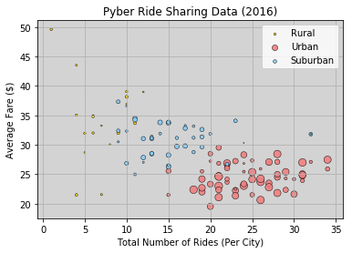

Observations:
1. While most of the drivers are in urban environments (77.8%), only half the total rides occur in urban environments
2. Urban riders tend to have lower average fares
3. Rural riders have the highest average fares

```python
# Dependencies
import matplotlib.pyplot as plt
import matplotlib.cm as cm
import numpy as np
import pandas as pd
import os
import seaborn as sns
```


```python
# Read CSV
csv_path1 = os.path.join('HW','ride_data.csv')
csv_path2 = os.path.join('HW','city_data.csv')


ride_data = pd.read_csv(csv_path1)
city_data = pd.read_csv(csv_path2)
ride_data.head()

```


<div>
<style>
    .dataframe thead tr:only-child th {
        text-align: right;
    }

    .dataframe thead th {
        text-align: left;
    }

    .dataframe tbody tr th {
        vertical-align: top;
    }
</style>
<table border="1" class="dataframe">
  <thead>
    <tr style="text-align: right;">
      <th></th>
      <th>city</th>
      <th>date</th>
      <th>fare</th>
      <th>ride_id</th>
    </tr>
  </thead>
  <tbody>
    <tr>
      <th>0</th>
      <td>Sarabury</td>
      <td>2016-01-16 13:49:27</td>
      <td>38.35</td>
      <td>5403689035038</td>
    </tr>
    <tr>
      <th>1</th>
      <td>South Roy</td>
      <td>2016-01-02 18:42:34</td>
      <td>17.49</td>
      <td>4036272335942</td>
    </tr>
    <tr>
      <th>2</th>
      <td>Wiseborough</td>
      <td>2016-01-21 17:35:29</td>
      <td>44.18</td>
      <td>3645042422587</td>
    </tr>
    <tr>
      <th>3</th>
      <td>Spencertown</td>
      <td>2016-07-31 14:53:22</td>
      <td>6.87</td>
      <td>2242596575892</td>
    </tr>
    <tr>
      <th>4</th>
      <td>Nguyenbury</td>
      <td>2016-07-09 04:42:44</td>
      <td>6.28</td>
      <td>1543057793673</td>
    </tr>
  </tbody>
</table>
</div>


```python
city_df = pd.DataFrame(city_data)
city_df['type'].value_counts()
```


    Urban       66
    Suburban    42
    Rural       18
    Name: type, dtype: int64


```python
test = ride_data.groupby(['city'])
test2 = test.agg({'fare': 'mean', 'ride_id':'count'})
sum_df = pd.DataFrame(test2).reset_index()
sum_df.head()
```


<div>
<style>
    .dataframe thead tr:only-child th {
        text-align: right;
    }

    .dataframe thead th {
        text-align: left;
    }

    .dataframe tbody tr th {
        vertical-align: top;
    }
</style>
<table border="1" class="dataframe">
  <thead>
    <tr style="text-align: right;">
      <th></th>
      <th>city</th>
      <th>fare</th>
      <th>ride_id</th>
    </tr>
  </thead>
  <tbody>
    <tr>
      <th>0</th>
      <td>Alvarezhaven</td>
      <td>23.928710</td>
      <td>31</td>
    </tr>
    <tr>
      <th>1</th>
      <td>Alyssaberg</td>
      <td>20.609615</td>
      <td>26</td>
    </tr>
    <tr>
      <th>2</th>
      <td>Anitamouth</td>
      <td>37.315556</td>
      <td>9</td>
    </tr>
    <tr>
      <th>3</th>
      <td>Antoniomouth</td>
      <td>23.625000</td>
      <td>22</td>
    </tr>
    <tr>
      <th>4</th>
      <td>Aprilchester</td>
      <td>21.981579</td>
      <td>19</td>
    </tr>
  </tbody>
</table>
</div>


```python
# Merge two dataframes using an outer join - 123 & 654
merge_table = pd.merge(sum_df, city_df, on="city", how="outer")
type_count = []
for row in merge_table['type']:
 
    if row == 'Urban':
 
        type_count.append('b')

    elif row == 'Suburban':

        type_count.append('r')

    else:
  
        type_count.append('y')
merge_table['type_count'] = type_count

merge_table.head()

```


<div>
<style>
    .dataframe thead tr:only-child th {
        text-align: right;
    }

    .dataframe thead th {
        text-align: left;
    }

    .dataframe tbody tr th {
        vertical-align: top;
    }
</style>
<table border="1" class="dataframe">
  <thead>
    <tr style="text-align: right;">
      <th></th>
      <th>city</th>
      <th>fare</th>
      <th>ride_id</th>
      <th>driver_count</th>
      <th>type</th>
      <th>type_count</th>
    </tr>
  </thead>
  <tbody>
    <tr>
      <th>0</th>
      <td>Alvarezhaven</td>
      <td>23.928710</td>
      <td>31</td>
      <td>21</td>
      <td>Urban</td>
      <td>b</td>
    </tr>
    <tr>
      <th>1</th>
      <td>Alyssaberg</td>
      <td>20.609615</td>
      <td>26</td>
      <td>67</td>
      <td>Urban</td>
      <td>b</td>
    </tr>
    <tr>
      <th>2</th>
      <td>Anitamouth</td>
      <td>37.315556</td>
      <td>9</td>
      <td>16</td>
      <td>Suburban</td>
      <td>r</td>
    </tr>
    <tr>
      <th>3</th>
      <td>Antoniomouth</td>
      <td>23.625000</td>
      <td>22</td>
      <td>21</td>
      <td>Urban</td>
      <td>b</td>
    </tr>
    <tr>
      <th>4</th>
      <td>Aprilchester</td>
      <td>21.981579</td>
      <td>19</td>
      <td>49</td>
      <td>Urban</td>
      <td>b</td>
    </tr>
  </tbody>
</table>
</div>


```python
x = merge_table['ride_id']
y = merge_table['fare']
z = merge_table['driver_count']


```


```python
testtable = merge_table['type'] == 'Urban'
urban_df = merge_table[testtable]
testtable2 = merge_table['type'] == 'Suburban'
suburban_df = merge_table[testtable2]
testtable3 = merge_table['type'] == 'Rural'
Rural_df = merge_table[testtable3]
Rural_df.head()
```


<div>
<style>
    .dataframe thead tr:only-child th {
        text-align: right;
    }

    .dataframe thead th {
        text-align: left;
    }

    .dataframe tbody tr th {
        vertical-align: top;
    }
</style>
<table border="1" class="dataframe">
  <thead>
    <tr style="text-align: right;">
      <th></th>
      <th>city</th>
      <th>fare</th>
      <th>ride_id</th>
      <th>driver_count</th>
      <th>type</th>
      <th>type_count</th>
    </tr>
  </thead>
  <tbody>
    <tr>
      <th>17</th>
      <td>East Leslie</td>
      <td>33.660909</td>
      <td>11</td>
      <td>9</td>
      <td>Rural</td>
      <td>y</td>
    </tr>
    <tr>
      <th>18</th>
      <td>East Stephen</td>
      <td>39.053000</td>
      <td>10</td>
      <td>6</td>
      <td>Rural</td>
      <td>y</td>
    </tr>
    <tr>
      <th>19</th>
      <td>East Troybury</td>
      <td>33.244286</td>
      <td>7</td>
      <td>3</td>
      <td>Rural</td>
      <td>y</td>
    </tr>
    <tr>
      <th>21</th>
      <td>Erikport</td>
      <td>30.043750</td>
      <td>8</td>
      <td>3</td>
      <td>Rural</td>
      <td>y</td>
    </tr>
    <tr>
      <th>25</th>
      <td>Hernandezshire</td>
      <td>32.002222</td>
      <td>9</td>
      <td>10</td>
      <td>Rural</td>
      <td>y</td>
    </tr>
  </tbody>
</table>
</div>


```python
fig, ax = plt.subplots()
plt.scatter(Rural_df['ride_id'], Rural_df['fare'], s=Rural_df['driver_count'], c='Gold', alpha=0.7, edgecolor = 'lightgrey', linewidth=2)
plt.scatter(urban_df['ride_id'], urban_df['fare'], s=urban_df['driver_count'], c='LightCoral', alpha=0.7, edgecolor = 'lightgrey', linewidth=2)
plt.scatter(suburban_df['ride_id'], suburban_df['fare'], s=suburban_df['driver_count'], c='LightSkyBlue', edgecolor = 'lightgrey', alpha=0.7, linewidth=2)
plt.legend()

plt.xlabel("Total Number of Rides (Per City)")
plt.ylabel("Average Fare ($)")
plt.title("Pyber Ride Sharing Data (2016)")
plt.grid()
#plt.legend((Rural_df['type'],urban_df['type'],suburban_df['type'])
plt.legend()
L=plt.legend()
L.get_texts()[0].set_text('Rural')
L.get_texts()[1].set_text('Urban')
L.get_texts()[2].set_text('Suburban')
ax.set_axis_bgcolor("ivory")
ax.set_clip_on(False)
plt.savefig('Bubble_chart.png')
plt.show()
```

    /Users/solomonmiller/anaconda3/envs/PythonData/lib/python3.6/site-packages/ipykernel_launcher.py:17: MatplotlibDeprecationWarning: The set_axis_bgcolor function was deprecated in version 2.0. Use set_facecolor instead.





```python
test = ride_data.groupby(['city'])
test2 = test.agg({'fare': 'sum', 'ride_id':'count'})
sum_df = pd.DataFrame(test2).reset_index()
merge_table = pd.merge(sum_df, city_df, on="city", how="outer")
citytp = merge_table.groupby(['type'])
group = citytp.agg({'fare': 'sum', 'ride_id':'count','driver_count':'sum'})
citytype_df = pd.DataFrame(group).reset_index()
citytype_df
```


<div>
<style>
    .dataframe thead tr:only-child th {
        text-align: right;
    }

    .dataframe thead th {
        text-align: left;
    }

    .dataframe tbody tr th {
        vertical-align: top;
    }
</style>
<table border="1" class="dataframe">
  <thead>
    <tr style="text-align: right;">
      <th></th>
      <th>type</th>
      <th>fare</th>
      <th>ride_id</th>
      <th>driver_count</th>
    </tr>
  </thead>
  <tbody>
    <tr>
      <th>0</th>
      <td>Rural</td>
      <td>4255.09</td>
      <td>18</td>
      <td>104</td>
    </tr>
    <tr>
      <th>1</th>
      <td>Suburban</td>
      <td>20335.69</td>
      <td>42</td>
      <td>638</td>
    </tr>
    <tr>
      <th>2</th>
      <td>Urban</td>
      <td>40078.34</td>
      <td>66</td>
      <td>2607</td>
    </tr>
  </tbody>
</table>
</div>


```python
labels = citytype_df['type']
sizes = citytype_df['fare']
colors = ['gold','lightskyblue','lightcoral']
explode = (0.08,0.08,0)
plt.pie(sizes, explode=explode, labels=labels, colors=colors,
        autopct="%1.1f%%", shadow=True, startangle=140)
plt.axis("image")
plt.title("% of Total Fares by City Type")
plt.savefig('Pie_chart1.png')
plt.show()
```


```python
labels = citytype_df['type']
sizes = citytype_df['ride_id']
colors = ['gold','lightskyblue','lightcoral']
explode = (0.08,0.08,0)
plt.pie(sizes, explode=explode, labels=labels, colors=colors,
        autopct="%1.1f%%", shadow=True, startangle=140)
plt.axis("image")
plt.title("% of Total Rides by City Type")
plt.savefig('Pie_chart2.png')
plt.show()
```


```python
labels = citytype_df['type']
sizes = citytype_df['driver_count']
colors = ['gold','lightskyblue','lightcoral']
explode = (0.08,0.08,0)
plt.pie(sizes, explode=explode, labels=labels, colors=colors,
        autopct="%1.1f%%", shadow=True, startangle=140)
plt.axis("image")
plt.title("% of Total Drivers by City Type")
plt.savefig('Pie_chart3.png')
plt.show()
```


